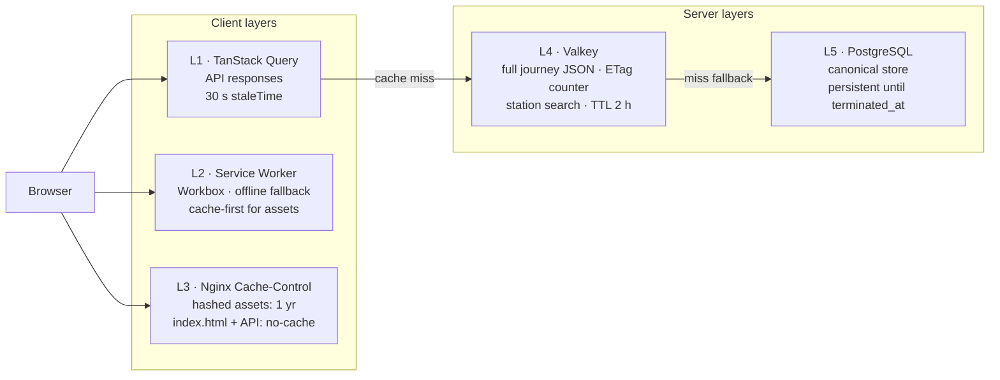

# Caching strategy

Five distinct layers. Each with its own consistency requirement + invalidation rule. Getting them wrong is the leading cause of "stale data" bugs.

## Layers



| # | Layer | TTL | Caches | Invalidation |
|---|-------|-----|--------|--------------|
| 1 | TanStack Query | 30 s summary / 0 s alternatives | API responses | `staleTime` expiry, manual `invalidateQueries` |
| 2 | Service Worker (Workbox) | network-only for live / cache-first for assets | Static assets + offline fallback | New SW activation |
| 3 | Nginx `Cache-Control` | 1 yr hashed / `no-cache` for `index.html` + API | Static assets | Hashed filename change |
| 4 | Valkey L1 | 2 h journey / 5 min station | Journey JSON, ETag counter | Poller writes, key expiry |
| 5 | Postgres L2 | until `terminated_at` | Canonical row | DELETE (manual or janitor) |

## Why ETags

Expensive part of polling is the wire payload, not JSON serialization. Client sends `If-None-Match` → backend (already has up-to-date `etag_counter` in Valkey) decides freshness.

ETag is stable + monotonic:

```
ETag = base64(etag_epoch || etag_counter)
       ↑           ↑              ↑
       │           │              └─ bumped on every state change
       │           └─ bumped on cold restart (Valkey empty)
       └─ ensures cross-instance uniqueness
```

Frontend stores last-seen ETag in TanStack Query cache. 304 → no state change. 200 → new ETag captured for next round.

## Valkey keys

| Key | Type | Value | TTL |
|-----|------|-------|-----|
| `journey:{id}` | string (JSON) | Full snapshot | `JOURNEY_TTL_HOURS` |
| `journey:{id}:etag` | string | `"epoch:counter"` | `JOURNEY_TTL_HOURS` |
| `journey:{id}:lock` | string | `host:pid` | 25 s |
| `stations:{q}` | string (JSON) | Up to 10 results | 5 min |
| `idem:{install-id}:{key}` | string (JSON) | Replayable body | 10 min |
| `ratelimit:install:{id}` | sliding window (Lua) | count | 1 min sliding |
| `ratelimit:ip:{ip}` | sliding window | count | 1 min sliding |

## Postgres ↔ Valkey consistency

**Valkey-first** for active-journey reads. Writes Valkey-then-Postgres:

```
poller.tick():
  ...
  if changed {
      WRITE Valkey   (SET journey:{id} new_state, EX ttl)
      WRITE Postgres (UPDATE journeys SET ...)
  }
```

Crash after Valkey but before Postgres: **Valkey value is truth** until TTL. Next handler reads Valkey, continues. Postgres catches up on next successful tick (or janitor reconciles).

Postgres ok but Valkey failed (e.g. Valkey restart): next read falls through to Postgres, refills Valkey. Cost: one Postgres read.

## Cache stampedes

- **Per-journey Valkey lock** (25 s). Only one poller ticks a journey at a time. Second instance (e.g. rolling deploy) sees lock, skips.
- **HAFAS request coalescing.** `coalescer` in `internal/hafas` dedups concurrent `tripUpdate(tripId)` — first caller fetches, subsequents subscribe to in-flight promise.

## Frontend invalidation

| Trigger | Action |
|---------|--------|
| `POST /v1/journeys` success | Set query data directly (skip redundant fetch) |
| `DELETE /v1/journeys/{id}` | Remove queries prefix `journey(id)`; clear Zustand `journeyId` |
| `summary.alternativeAvailable` → `true` | Invalidate `alternatives(id)` |
| `summary.status` → `CRITICAL` or `INFEASIBLE` | Show modal; no invalidate (next poll catches it) |
| Network reconnects | TanStack Query `onlineManager` refetches all stale |

## Nginx headers

```nginx
# index.html — never cached
location = /index.html { add_header Cache-Control "no-cache, no-store, must-revalidate" always; }

# Hashed assets — immutable
location ~* \.(js|css|woff2|png|svg|ico)$ {
    expires 1y;
    add_header Cache-Control "public, immutable" always;
}

# API — never cached (proxied to backend)
location /v1/ { proxy_pass http://backend:8080; expires -1; }
```

Guarantees new deploys land on next page load (`index.html` always fresh) while hashed assets enjoy year-long cache.
