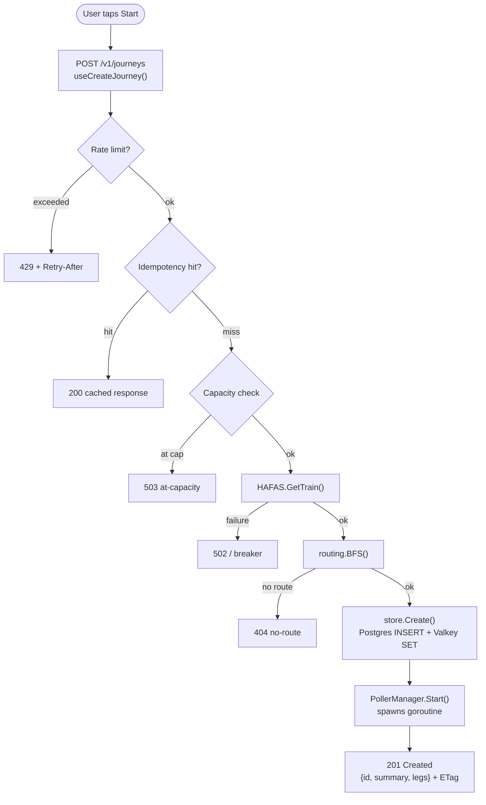
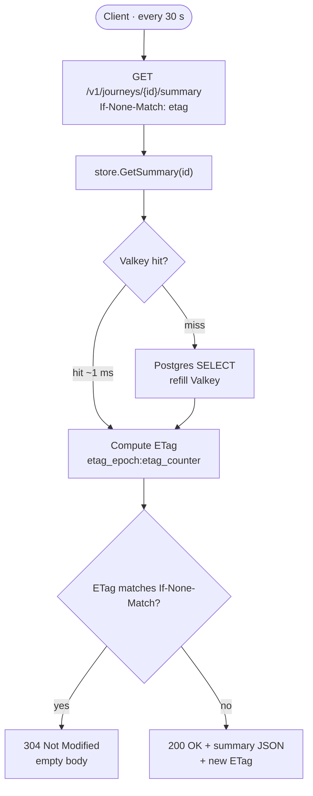
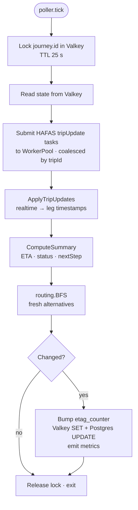

# Data flow

End-to-end traces for the two core flows.

## Flow 1 — Create

Poller performs first tick immediately (no 30 s wait) — first client poll returns fresh data.

## Flow 2 — Poll

Concurrently, poller (independent of client) every 30 s:

Client + poller never interact directly. They share state via Valkey. Client polls are *almost always* 304 in steady state; **journey changes are driven by the poller alone.**

## Failure paths

| Failure | Backend | Frontend |
|---------|---------|----------|
| HAFAS down (breaker open) | 503 `urn:verspbegl:error:hafas-unavailable` | Banner: "Live data unavailable — retrying"; show last-known |
| Valkey down | 500 `urn:verspbegl:error:internal` + log | Generic error banner, manual retry |
| Postgres down | `/readyz` 503 | Same — backend keeps serving last Valkey snapshot until TTL |
| Network offline | `fetch` rejects | OfflineStateLoader reads IndexedDB |
| Rate limit | 429 + Retry-After | Banner + countdown; calls suppressed until Retry-After |
| Idempotency replay | 200 from Valkey-cached response | Indistinguishable from normal success — by design |

## TTLs

| Object | TTL | Where |
|--------|-----|-------|
| Active journey | `JOURNEY_TTL_HOURS` (default 2 h since last poll) | Valkey + Postgres (`terminated_at` set by GC) |
| Idempotency key | 10 min | Valkey only |
| Station search | 5 min | Valkey only |
| Per-journey poller goroutine | Bound to journey lifetime | In-memory |
| Per-journey lock | 25 s | Valkey (auto-expires on tick crash) |

Background janitor sweeps every 5 min for `terminated_at IS NULL AND last_polled_at < now() - JOURNEY_TTL_HOURS`. Stops poller, sets `terminated_at`, frees capacity.
