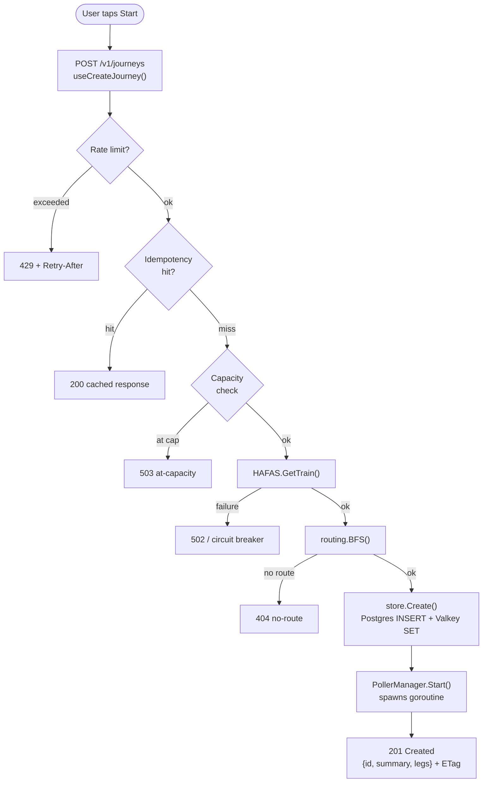
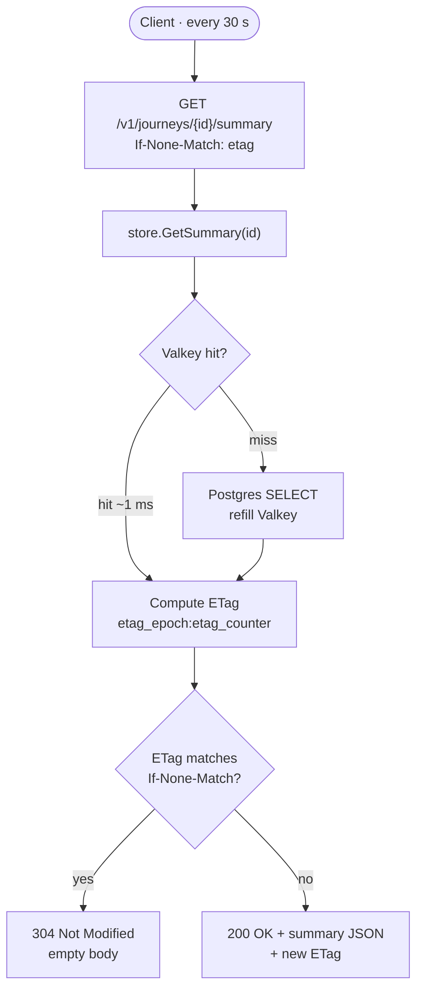
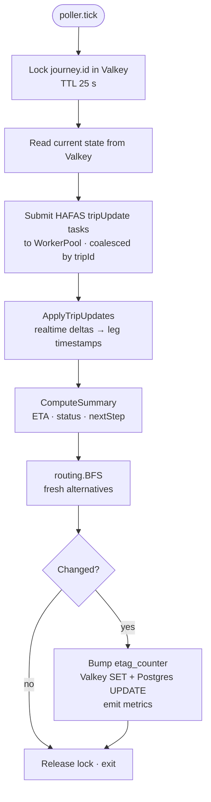
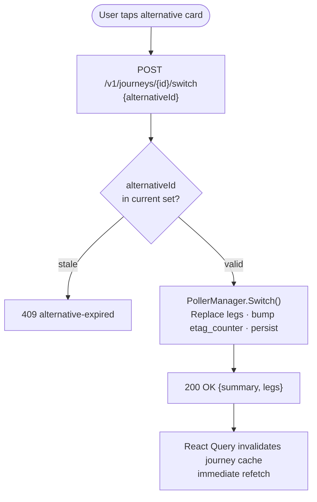

# Data flow

End-to-end traces for the three flows that matter: creating a journey, polling its status, and switching to an alternative.

## Flow 1 — Create a new journey

The poller immediately performs its first tick (no 30-second wait) so the first poll from the client returns up-to-date data.

## Flow 2 — Poll for updates

Concurrently, the poller goroutine (independent of the client) ticks every 30 s:

Client and poller never interact directly. They share state via Valkey. The 30-second client polls are *almost always* 304 in steady state; the **content of the journey changes** is driven by the poller alone.

## Flow 3 — Switch to an alternative

The next client poll arrives ~30 s later and returns a 200 with the new ETag. From the user's perspective, the timeline switches instantly because the React Query cache for the active journey is invalidated and refetched as part of the success handler.

## Failure paths

| Failure | Backend response | Frontend behaviour |
|---------|-------------------|--------------------|
| HAFAS down (circuit breaker open) | 503 `urn:verspbegl:error:hafas-unavailable` | Banner: "Live data unavailable — retrying", keep showing last-known data |
| Valkey down | 500 `urn:verspbegl:error:internal` + log | Generic error banner, manual retry available |
| Postgres down | `/readyz` returns 503 | Same — backend keeps serving the last Valkey snapshot until journey TTL |
| Network offline | `fetch` rejects | OfflineStateLoader takes over, reads from IndexedDB |
| Rate limit hit | 429 + Retry-After | Banner with countdown; subsequent calls suppressed until Retry-After elapses |
| Idempotency replay | 200 OK from Valkey-cached response | Indistinguishable from a normal success — by design |

## TTLs and retention

| Object | TTL | Where |
|--------|-----|-------|
| Active journey | `JOURNEY_TTL_HOURS` (default 2 h since last poll) | Valkey + Postgres (`terminated_at` set by GC job) |
| Idempotency key | 10 minutes | Valkey only |
| Station search | 5 minutes | Valkey only |
| Per-journey poller goroutine | Bound to journey lifetime | In-memory |
| Per-journey lock | 25 s | Valkey (auto-expires if tick crashes mid-flight) |

A background goroutine ("janitor") sweeps every 5 minutes for journeys with `terminated_at IS NULL AND last_polled_at < now() - JOURNEY_TTL_HOURS`. It stops the poller and sets `terminated_at`, freeing capacity.
