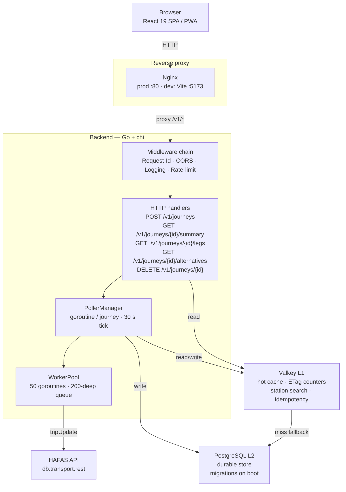

# Architecture overview

## Layered design

| Layer | Responsibility | Lives in |
|-------|----------------|----------|
| **HTTP** | Routing, content negotiation, RFC 7807 error mapping | `internal/api/handlers`, `internal/api/middleware` |
| **Domain** | Journey / Leg / Summary types, status derivation, filter rules | `internal/journey/model.go`, `internal/journey/compute.go` |
| **Routing** | BFS over HAFAS legs, ETA scoring | `internal/routing` |
| **HAFAS adapter** | REST client, response mapping, circuit breaker, worker pool | `internal/hafas` |
| **Persistence** | Valkey L1 (full journey JSON, ETag counter), Postgres L2 (canonical store) | `internal/journey/store.go` |
| **Observability** | Prometheus metrics, structured logging, health probes | `internal/metrics`, `internal/api/handlers/health.go` |

## Why this shape

- **Per-journey goroutines**: each active journey owns a single goroutine with a 30-second ticker. State is read from / written to Valkey under a per-journey lock. This keeps the model simple — no fan-out, no work-stealing — and bounded by `MAX_ACTIVE_JOURNEYS` (default 2000).
- **Bounded HAFAS concurrency**: a global `WorkerPool` (default 50 goroutines, 200-deep queue) serialises requests to the public HAFAS proxy. When the queue is full, `Submit()` returns `false` and the caller backs off — preventing thundering-herd failures during DB nationwide incidents.
- **Circuit breaker**: 5 consecutive HAFAS failures opens the breaker. A probe every 30 s closes it again. While open, all callers fail fast with `urn:verspbegl:error:hafas-unavailable`.
- **ETag-based polling**: the frontend re-polls `/summary` every 30 s with `If-None-Match`. The backend short-circuits with **304** when nothing changed, which is the dominant case — minimising bandwidth and CPU.
- **Two-tier cache**: Valkey serves the polling traffic at sub-millisecond latency. Postgres is the durable source of truth — used on cold misses, server restart, or replica recovery.

## Why not …

| Question | Answer |
|----------|--------|
| **Why not WebSockets / SSE for updates?** | Per-journey poll is already 30 s; ETag makes the cost trivial. WebSockets add infra complexity (load-balancer stickiness, lifecycle management) for marginal gain. |
| **Why not a job queue (NATS / Kafka)?** | The natural unit of work is *one journey, one ticker*. A queue would re-marshal the same goroutine pattern with extra hops. |
| **Why not GraphQL?** | Three flat endpoints map cleanly to three UI surfaces. GraphQL would add 80 KB to the client bundle for no expressivity gain. |
| **Why Go for the backend?** | Bounded-concurrency goroutines, tiny static binaries, mature HTTP ecosystem, and zero GC pauses in the polling hot path. |
| **Why React 19 + Vite, not Next.js?** | This is a single-user PWA, not a content site. SSR/edge rendering buys nothing. Vite cold start is ~400 ms; HMR is instant. |

## Module boundaries

The backend follows strict layering: `internal/api` → `internal/journey` → `internal/hafas`. Lower layers must not import upper layers. The compiler enforces this via Go's standard package visibility.

The frontend mirrors the same idea via folder convention: `screens/` may import `hooks/`, `hooks/` may import `api/` and `lib/`, but never the reverse.

Continue with the [Backend deep-dive](./backend), [Frontend deep-dive](./frontend), or [Data flow](./data-flow).
